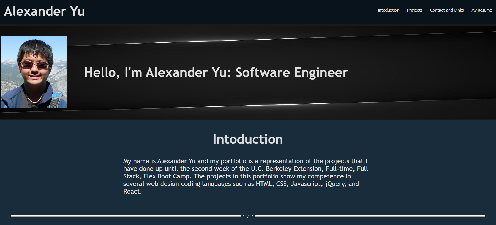

# 2-Professional-Portfolio
This assignment was assigned by the U.C. Berkeley Extension Full-time Full Stack Flex Boot Camp.
This is assignment 2 for the program. In this assignment I created a mock portfolio page for myself to showcase the work I have not done yet.

I implement programming concepts such as:
- flexbox
- media queries
- CSS variables

Due: Tuesday, March 23, 2021 11:59 PM

## Built With

* [HTML](https://developer.mozilla.org/en-US/docs/Web/HTML)
* [CSS](https://developer.mozilla.org/en-US/docs/Web/CSS)

## Deployed Link

* [See Live Site](https://acedyu.github.io/2-Professional-Portfolio/)

## Authors
AcedYu
- [Link to Github](https://github.com/AcedYu)
- [Link to LinkedIn](https://www.linkedin.com/in/alex-yu-3712811b9/)
